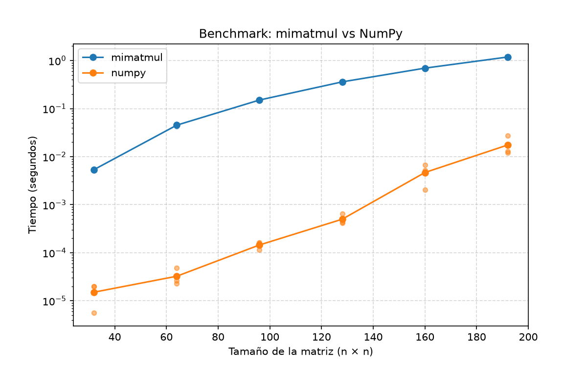

# P0-Mosqueira-Javiera

Proyecto 0 — **Introducción al benchmarking y al trabajo con agentes de IA**

Ramo: Métodos Computacionales en Ingeniería en Obras Civiles

---

## 1. Propósito del proyecto

El objetivo de este proyecto es preparar un ambiente de trabajo para el resto
del curso e introducir una forma de desarrollo basada en agentes de
inteligencia artificial (OpenCode).

El proyecto incluye:
- Investigar las características del computador (`src/system_info.py`);
- Implementar una multiplicación de matrices con ciclos explícitos de Python
  (`src/mimatmul.py`);
- Verificar esa implementación con pruebas automáticas
  (`tests/test_mimatmul.py`);
- Comparar su rendimiento contra la operación optimizada de NumPy mediante un
  benchmark (`src/benchmark.py`).

## 2. Estructura del repositorio

```
P0-Mosqueira-Javiera/
├── README.md
├── AGENTS.md
├── requirements.txt
├── src/
│   ├── system_info.py
│   ├── mimatmul.py
│   └── benchmark.py
├── tests/
│   └── test_mimatmul.py
├── data/
│   ├── system_info.json
│   └── benchmark_results.csv
└── figures/
    └── benchmark.png
```

## 3. Computador

Características del equipo evaluado, obtenidas con `src/system_info.py` y
verificadas con herramientas del sistema operativo:

| Característica | Valor |
| --- | --- |
| Sistema operativo | Windows 11 (arquitectura AMD64) |
| Versión de Python | 3.14.7 |
| Procesador | Intel(R) Core(TM) Ultra 9 185H |
| Núcleos físicos | 16 |
| Procesadores lógicos | 22 |
| Memoria RAM total | 31.42 GB |
| GPU | NVIDIA GeForce RTX 4070 Laptop GPU + Intel(R) Arc(TM) Graphics |
| Disco C: | 924.09 GB |

Los datos completos se encuentran en `data/system_info.json`.

## 4. Instalación

### Requisitos previos

- **Python 3.14** (verificar con python --version)
- **Git** (verificar con git --version)

### 1. Obtener el proyecto desde GitHub

```powershell
git clone https://github.com/javimosqueira/P0-Mosqueira-Javiera.git
cd P0-Mosqueira-Javiera
```

### 2. Ambiente Virtual

Crear el ambiente virtual:

```
python -m venv .venv
```

Activar el ambiente virtual (powershell):

```
.\.venv\Scripts\Activate.ps1
```

### 3. Instalar las dependencias

```powershell
pip install -r requirements.txt
```

El archivo `requirements.txt` fija las versiones exactas de las bibliotecas
para que el ambiente sea reproducible.

Con esto, el ambiente queda listo para ejecutar las pruebas, el script de
información del computador y el benchmark.

## 5. Ejecución

| Comando | Descripción |
| --- | --- |
| `python -m pytest` | Ejecuta las pruebas automáticas |
| `python src\system_info.py` | Obtiene la información del computador |
| `python src\benchmark.py` | Ejecuta el benchmark y genera el gráfico |

## 6. Resultados del benchmark

El benchmark ejecuta `mimatmul` y NumPy para matrices de 32×32 hasta 192×192,
con 3 repeticiones por tamaño y mide el tiempo con `time.perf_counter()`. Los
datos de cada repetición están en `data/benchmark_results.csv` y el
gráfico en `figures/benchmark.png`.



## 7. Estado actual del proyecto

| Etapa | Descripción | Estado |
| --- | --- | --- |
| 1 | Ambiente de desarrollo | Completada |
| 2 | Información del computador | Completada |
| 3 | `mimatmul` y pruebas automáticas | Completada (5 pruebas en verde) |
| 4 | Benchmark y gráfico | Completada |
| 5 | Documentación y revisión final | Completada |

## 8. Observaciones de rendimiento

Las respuestas se basan en observaciones del Administrador de tareas de Windows
durante dos corridas del mismo tipo de cálculo (multiplicación de matrices):

| Carga | CPU | Memoria RAM | GPU |
| --- | --- | --- | --- |
| `mimatmul` | 1 núcleo al 100% | 13.7 GB de 31.4 GB | 0% |
| NumPy | todos los núcleos al 100% | 13.7 GB de 31.4 GB | 0% |

### Respuestas a las preguntas de rendimiento

> **¿mimatmul parece utilizar uno o varios núcleos?**

Uno solo. En la corrida de observación se multiplicaron matrices de 96×96 con
`mimatmul` durante 30 segundos (189 multiplicaciones, 0.16 s por
multiplicación) y el proceso Python usó 1 núcleo al 100%.

> **¿NumPy parece utilizar uno o varios núcleos?**

Varios. En la corrida de observación se multiplicaron matrices de 3000×3000
con NumPy durante 30 segundos (84 multiplicaciones, 0.36 s por multiplicación)
y el proceso usó todos los núcleos al 100%. NumPy delega la multiplicación a
bibliotecas optimizadas (BLAS) que usan todos los hilos disponibles.

> **¿Por qué NumPy es más rápido?**

NumPy es más rápido porque delega el cálculo a código compilado en C/Fortran
(BLAS) en lugar de ciclos interpretados de Python, usa todos los núcleos y
optimiza el uso de la memoria caché y del hardware. En la corrida de
observación, en 30 segundos `mimatmul` hizo 189 multiplicaciones de 96×96 y
NumPy 84 de 3000×3000, un trabajo del orden de 1000 veces mayor por operación.

> **¿Por qué las repeticiones no entregan exactamente el mismo tiempo?**

Porque el sistema tiene otras cargas variables (procesos en segundo plano,
escritorio) y el sistema operativo reparte los núcleos. Las mediciones incluyen
ruido del cronómetro y del sistema. Por eso el benchmark repite cada tamaño y
reporta el tiempo promedio.

> **¿Cuál es aproximadamente la matriz cuadrada de mayor tamaño que cabría en la RAM libre del computador?**

Con 31.42 GB de RAM total y aproximadamente 13.7 GB usados durante la
observación, quedaban 17.7 GB libres. Para multiplicar dos matrices (A·B = C)
se necesitan tres matrices de números de 64 bits (8 bytes): A, B y el resultado
C. Si cada una es de lado `n`, el total es `3·8·n²` bytes, por lo que
`n ≈ √(17.7e9/24) ≈ 27 000`. Por lo tanto, con NumPy se podrían multiplicar,
aproximadamente, matrices de **27000×27000**. Sin embargo, para `mimatmul` el
límite del tamaño de la matriz es menor.

## 9. Uso de OpenCode

Reflexión sobre el trabajo con el agente de IA durante el proyecto:

> **¿Qué parte realizó correctamente el agente?**

El agente configuró el ambiente de desarrollo (venv, dependencias y Git),
generó el script de información del computador, implementó `mimatmul` con la
validación de dimensiones, escribió las pruebas automáticas y el benchmark
con su gráfico. 

> **¿Qué parte tuvo que corregir o modificar?**

Modifiqué el README y también fui revisando cada uno de los pasos realizados y archivos creados, para verificar que se cumpliera con lo solicitado.

> **¿Qué archivo comprende mejor después del proyecto?**

`src/mimatmul.py` y `tests/test_mimatmul.py`: en `mimatmul.py` revisé cómo los
tres ciclos calculan cada elemento de la matriz de resultado y por qué su
implementación con ciclos de Python es lenta comparada con NumPy; en
`tests/test_mimatmul.py` entendí cómo las pruebas verifican la multiplicación
con matrices de dimensiones conocidas y la validación de errores.

> **¿Qué parte del código todavía le resulta menos clara?**

El manejo de `sys.path` y la generación del gráfico en `src/benchmark.py`. 
